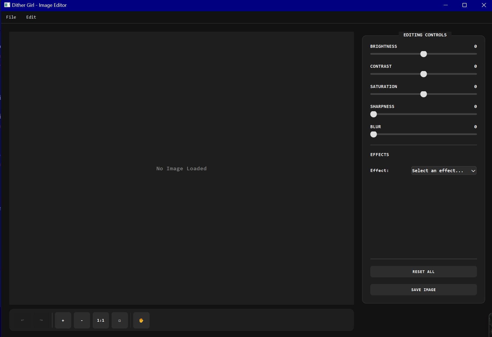

# Dither Girl


A modern image editor with artistic effects and a minimalist dark interface, built with PyQt6 and OpenCV.



## ✨ Features

### 🎛️ Image Adjustments
- **Basic Controls**: Brightness, contrast, saturation, sharpness, and blur
- **Non-destructive Editing**: All adjustments preserve original image quality
- **Real-time Preview**: See changes as you adjust parameters

### 🎨 Special Effects
- **Filters**: Grayscale, negative, sepia, vignette, warm/cool tones
- **Artistic Effects**: Cartoon, watercolor, oil painting, emboss, edge detection
- **Creative Styles**: Posterize, pixelate, glitch, HDR enhancement
- **Color Manipulation**: Advanced color grading with intensity controls

### 💻 Interface
- **Modern Design**: Dark minimal aesthetic with monospace fonts
- **Image Navigation**: Zoom in/out, fit to view, and actual size options
- **Hand Tool**: Pan easily around large images
- **History**: Full undo/redo functionality for all operations
- **File Management**: Open and save in common image formats

## 🚀 Installation

1. Clone the repository:
   ```sh
   git clone https://github.com/udaysinh-git/dither-girl.git
   cd dither-girl
   ```

2. Install the required dependencies:
   ```sh
   pip install -r requirements.txt
   ```

## 🎮 Usage

1. Run the application:
   ```sh
   python main.py
   ```

2. Using the editor:
   - **Open an image**: Use File > Open or the Open button
   - **Apply adjustments**: Use sliders in the sidebar to modify image properties
   - **Apply effects**: Select an effect from the dropdown and set parameters
   - **Navigate**: Use zoom controls and the hand tool for large images
   - **History**: Use undo/redo buttons or Ctrl+Z/Ctrl+Y shortcuts
   - **Save**: Use File > Save or the Save button

## 🧩 Project Structure

```
dither-girl/
├── algorithms/           # Dithering and other core algorithms
├── edit/                 # Basic image editing filters
│   ├── image_filters.py  # Core image processing algorithms
├── effects/              # Special effect implementations
│   ├── base.py           # Base effect class
│   ├── cartoon.py        # Cartoon effect implementation
│   ├── ...               # Other effect implementations
├── ui/                   # User interface components
│   ├── components/       # Reusable UI components
│   ├── main_window.py    # Main application window
│   ├── styles.py         # UI styling
├── utils/                # Utility functions
│   ├── image_loader.py   # Image loading/saving utilities
├── main.py               # Application entry point
```

## 🛣️ Roadmap

- [ ] Layer system for non-destructive editing
- [ ] Custom brushes and drawing tools
- [ ] Selection tools and masks
- [ ] Export to additional file formats
- [ ] Performance optimizations for large images
- [ ] Additional dithering algorithms

## 🤝 Contributing

Contributions are welcome! Please follow these steps:

1. Fork the repository
2. Create a feature branch: `git checkout -b feature-name`
3. Make your changes and commit: `git commit -m 'Add some feature'`
4. Push to your branch: `git push origin feature-name`
5. Open a pull request

Please read [CONTRIBUTING.md](CONTRIBUTING.md) for details on our code of conduct and pull request process.

## 💬 Community

Join our vibrant Discord community to connect with other Dither Girl users and developers!

[](https://discord.gg/ZujvWEYedQ) 

### Why Join?
- **Get Early Access** to beta features and experimental effects
- **Share Your Creations** and get feedback from fellow artists
- **Influence Development** by directly engaging with the core team
- **Troubleshoot Issues** with help from the community and developers
- **Learn Advanced Techniques** through community tutorials and tips

We host regular community events including image editing challenges, effect design workshops, and Q&A sessions with the development team!

## 📄 License

This project is licensed under the MIT License - see the [LICENSE](LICENSE) file for details.

## 🙏 Acknowledgements

- [PyQt6](https://www.riverbankcomputing.com/software/pyqt/intro) for the GUI framework
- [OpenCV](https://opencv.org/) for image processing capabilities
- [NumPy](https://numpy.org/) for array operations
- All contributors who have helped improve this project
